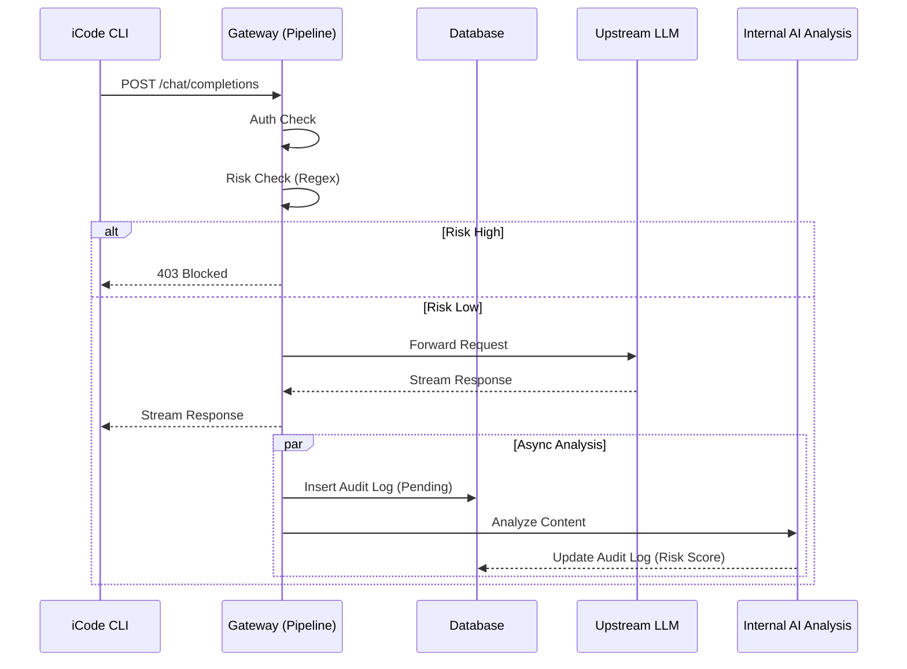

# iCode Gateway V2 架构设计方案 (Pipeline + AI Analysis)

## 1. 核心设计理念

根据需求，iCode Gateway 需要在保持对 Client 端 (CLI/Agents) "透明管道" 特性的同时，内部具备强大的 AI 分析能力。

-   **对 Client 端 (External)**: Gateway 是一个标准的 Proxy。它不改变 LLM 的业务逻辑，不存储业务状态，仅做传输、鉴权和安全审计。
-   **对 Admin 端 (Internal)**: Gateway 是一个智能的安全分析中心。它利用 AI 对流经的数据进行实时或离线的分析，提供风险预警、行为审计和效能洞察。

## 2. 架构分层 (Layered Architecture)

为了实现上述目标，后端架构将拆分为 **同步处理链路 (Pipeline)** 和 **异步分析链路 (Async Analysis)**。

### 2.1 同步链路 (Pipeline Layer) - "The Guard"
*关注点：低延迟、高吞吐、阻断风险*

1.  **Entry (Hono Route)**: 接收 CLI 请求。
2.  **Auth Middleware**: 校验 Session/Token。
3.  **Risk Engine (Fast)**:
    *   **Rule-based**: 正则匹配 (Regex) 扫描高危关键词 (Key/Secret/PII)。
    *   **Cache-based**: 频次限制 (Rate Limiting)。
    *   *Decision*: Pass (放行) / Block (阻断)。
4.  **Proxy Service**:
    *   请求转发至上游 LLM (OpenAI/Azure/DeepSeek)。
    *   流式响应 (SSE) 透传。
5.  **Audit Logger**:
    *   将请求元数据 (User, Prompt Hash, Timestamp) 写入数据库。
    *   将完整 Prompt/Completion 推送至 **异步消息队列** (或内存队列) 供分析使用。

### 2.2 异步链路 (Analysis Layer) - "The Brain"
*关注点：深度分析、智能化、非阻塞*

1.  **Analysis Service**:
    *   消费审计日志队列。
    *   **AI Security Check**: 调用内部小模型 (或专用 API) 对 Prompt 进行深度安全检测 (Prompt Injection, Jailbreak)。
    *   **Code Quality Insight**: 分析生成的代码片段，统计语言分布、代码质量评分 (可选)。
    *   **Behavior Analysis**: 识别异常用户行为 (如短时间内大量请求敏感数据)。
2.  **Storage**:
    *   更新 `audit_logs` 表中的 `risk_score` 和 `analysis_result` 字段。
    *   生成统计报表数据。

## 3. 目录结构重构 (Refactoring)

为了支持该架构，`server/` 目录将进行如下重构：

```
server/
├── index.ts                # 入口文件
├── db/                     # 数据库层
│   ├── schema.ts           # Drizzle Schema
│   └── index.ts            # DB Connection
├── routes/                 # 路由层 (Controller)
│   ├── api.ts              # /api/v1 (Client面向)
│   └── admin.ts            # /api/v1/admin (管理面向)
├── middleware/             # 中间件
│   ├── auth.ts             # 鉴权
│   └── logger.ts           # 基础日志
├── services/               # 业务逻辑层
│   ├── proxy.ts            # Proxy Service (LLM转发)
│   ├── risk.ts             # Risk Engine (同步规则)
│   └── analysis.ts         # Analysis Service (异步AI分析)
└── types/                  # 类型定义
```

## 4. 关键流程图 (Data Flow)



## 5. 执行计划

1.  **Phase 1: 重构 (Refactor)**
    *   将 `server/index.ts` 拆分为 `routes/` 和 `services/` 结构。
    *   分离 `ProxyService` 和 `RiskService`。
2.  **Phase 2: 异步分析服务 (Async Service)**
    *   实现 `AnalysisService` 类。
    *   在 Proxy 请求完成后，非阻塞地调用 `AnalysisService.analyze()`。
    *   模拟 AI 分析逻辑 (暂用 Mock 或简单逻辑替代真实 LLM 调用)。
3.  **Phase 3: 数据增强 (Data Enrichment)**
    *   在 `audit_logs` 表中增加 `analysis_metadata` 字段。
    *   在 Dashboard 中展示 AI 分析结果。
